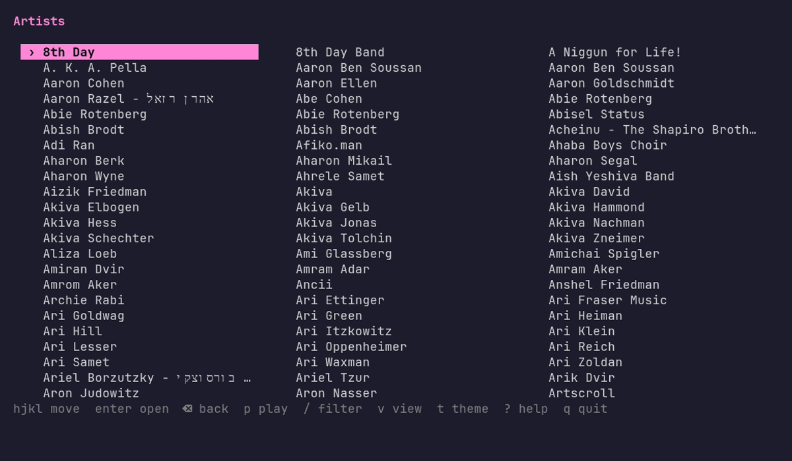
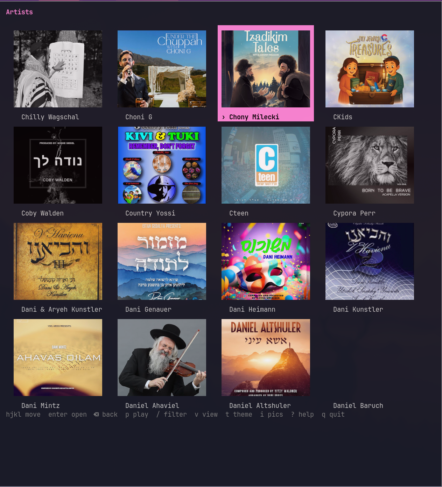

# gooseneck-player

A terminal UI for browsing the `artists.json` catalog and streaming artists
straight into a media player via `yt-dlp`.



Real profile pics in the grid on Kitty-graphics terminals (Ghostty, Kitty):



Demo recorded with [VHS](https://github.com/charmbracelet/vhs) — see
[`demo.tape`](demo.tape). Regenerate with `vhs demo.tape` after building.

## Install

Detects your OS/arch and grabs the matching binary from the latest release:

```sh
curl -fsSL https://raw.githubusercontent.com/lubabs770/gooseneck/main/install.sh | sh
```

Installs to `~/.local/bin` (override with `BIN_DIR=`, pin with `VERSION=vX.Y.Z`).
Windows: download the `.exe` from the [releases page](https://github.com/lubabs770/gooseneck/releases).
Needs a published release — see [Build player](../.github/workflows/build-player.yml) CI (tag `v*` to cut one). Runtime deps: `yt-dlp` + `mpv`.

## Build

```sh
cd player
go build -o gooseneck-player .
```

Requires Go 1.23+. Runtime deps: `yt-dlp` and a player (`mpv` by default).

## Run

```sh
goose            # or: gooseneck-player
```

No data file needed: on first run it downloads the catalog from the skmusic
worker (`artists_url`) and caches it at `~/.config/gooseneck/artists.json`. A
local `artists.json` next to the binary or in the repo root is used instead when
present (dev convenience). Override the path via `artists_json` in the config.

## Config

Written on first run to `~/.config/gooseneck/config.toml`:

```toml
bin_dir      = ""            # directory holding yt-dlp; "" = use $PATH
player       = "mpv"         # media player; $APP env var overrides this
player_args  = ["--no-video"] # audio-only by default
artists_json = ""            # explicit path; "" = auto-detect/download
artists_url  = "https://skmusic.shalomkarr.workers.dev/data/artists.json"
theme        = "default"     # default | gruvbox | nord | mono
view         = "grid"        # grid | list
show_help    = true          # show the key-hints line at startup (toggle live with ?)
caret        = true          # show a ›caret on the selection in both grid and list
thumbnails   = true          # artist profile pics in grid & list views (toggle live with i)
thumb_height = 0             # profile-pic height in rows; 0 = auto (square cards)
```

On terminals that speak the **Kitty graphics protocol** (Kitty, Ghostty) profile
pics render as real bitmap images via Unicode placeholders. Elsewhere they fall
back to truecolor half-block art (needs a 24-bit-color terminal). Thumbnails come
from the catalog's `thumbnail` URL, rewritten to a square center-crop
(googleusercontent `=s…-c`) so both square avatars and wide channel banners fill
a card cleanly. Only the visible page is fetched (lazily, off the UI thread) and
cached under `~/.config/gooseneck/thumbs/`.

The SQLite cache (`~/.config/gooseneck/cache.db`) stores each artist's track list
so re-opening an artist is instant. Delete the file to force a refresh.

## Keys

| Key | Action |
|-----|--------|
| `h j k l` | move (arrows work too) |
| `enter` | drill in: artist → albums → tracks |
| `⌫` / `h` (list view) | back |
| `p` | play — on an artist queues all their tracks; on an album queues that album; on a track plays that one |
| `/` | fuzzy filter (fzf-style); `esc` clears |
| `v` | toggle grid / list |
| `t` | cycle theme |
| `i` | toggle artist profile pics (starts from `thumbnails`) |
| `?` | toggle the key-hints line (starts from `show_help`) |
| `g` / `G` | top / bottom |
| `ctrl-d` / `ctrl-u` | half-page down / up |
| `q` | quit |

## How playback works

Each artist entry is a YouTube Music "- Topic" channel id. Opening an artist fully
extracts their uploads with `yt-dlp` and groups the tracks into albums by each
track's `album` field; singles (album == title) collapse into one **Singles**
bucket. This first extraction is slow (network per track) but the result is cached
in SQLite, so re-opening is instant. Delete `cache.db` to force a re-index.
Playback hands the watch URLs to the player; `mpv --no-video` streams audio only.

## Roadmap

- **Faster album indexing** — the per-track full extraction is the bottleneck;
  explore batching or a lighter metadata source.
- **Background pre-indexing** — every play is now logged to
  `~/.config/gooseneck/logs.json` (artist / album / track / time) and `topArtists`
  ranks the most-listened. Still TODO: a background job that uses that ranking to
  pre-index / refresh hot artists' catalogs on a schedule, keeping them warm.
- **Rounded thumbnails** — round the corners of profile pics in grid and list
  for a softer card look.
- **Placeholder for missing thumbnails** — artists with no `thumbnail` URL
  render blank; show a generated placeholder (initials / silhouette) instead.
- **Playback options** — shuffle a queue, and auto-advance ("play on") to the
  next track / album / artist when the current queue finishes.
- **Multiple catalog files** — `artists_json` takes a single path today; support
  a list of catalogs (or a catalog directory) so a personal/side `artists.json`
  can sit alongside the main one, merged into the grid or switchable at runtime.
